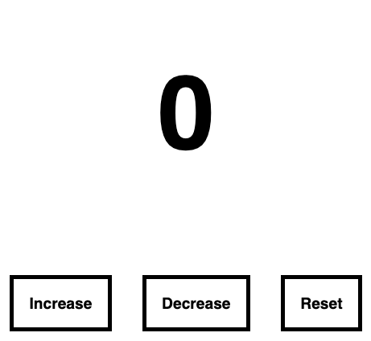

# HTML5 Web Storage

## What is HTML Web Storage?

Web applications can store data locally within the user's browser with Web Storage

- Before HTML5, application data had to be stored in cookies, included in every server request.
- Web storage is more secure, and large amounts of data can be stored locally, without affecting website performance.

- Unlike cookies, the storage limit is far larger (at least 5MB) and information is never transferred to the server.

- Web storage is per origin (per domain and protocol). All pages, from one origin, can store and access the same data.

## HTML5 Web Storage `Objects`

- HTML web storage provides two objects for storing data on the client:
  - **`localStorage`** - stores data with no expiration date
  - **`sessionStorage`** - stores data for one session (data is lost when the browser tab is closed)

`Important! - please check browser support before using these storage machenism`

## The **`localStorage`** Object

- The Local Storage API provides mechanisms by which browsers can securely store `key/value` pairs.
- The localStorage object stores the data with no expiration date.
- The data will not be deleted when the browser is closed, and will be available the next day, week, or year.
- Data stored in localStorage is specific to current domain/site, other sites can't access it.

### The syntax for creating the localStorage item is as follows

```js
const currentUser = localStorage.setItem("user", "Mukhtar Mahamed");
```

### The syntax for reading the localStorage item is as follows

```js
const currentUser = localStorage.getItem("user");
```

### The syntax for removing the localStorage item is as follows

```js
const currentUser = localStorage.removeItem("username");
```

### The syntax for removing all the localStorage items is as follows:

```js
const currentUser = localStorage.clear();
```

`Note: Name/value pairs are always stored as strings. Remember to convert them to another format when needed!`

---

## The **`sessionStorage`** Object

- The sessionStorage object is equal to the localStorage object, except that it stores the data for only one session.
- The data is deleted when the user closes the specific browser tab.

### The `SessionStorage` Object Methods

```js
// for creating
SessionStorage.setItem(name, value);

// for reading
SessionStorage.getItem(name);

// for removing
SessionStorage.removeItem(name, value);

// for deleting all data
SessionStorage.clear();
```

### Storing an Array or Object in a localStorage.

If we are storing an array or an object, we should `stringify` the object first. See the example below.

```js
const webTech = ["HTML", "CSS", "JS", "React"];

//Skills array has to be stringified first to keep the format.
const skillsJSON = JSON.stringify(webTech);

// than save to localStroage
localStorage.setItem("skills", skillsJSON);

console.log(localStorage);
```

Storing Array of Objects

```js
let skills = [
  { tech: "HTML", level: 10 },
  { tech: "CSS", level: 9 },
  { tech: "JS", level: 8 },
  { tech: "React", level: 9 },
  { tech: "Redux", level: 10 },
  { tech: "Node", level: 8 },
  { tech: "MongoDB", level: 8 },
];

let skillJSON = JSON.stringify(skills);

localStorage.setItem("skills", skillJSON);
```

## getting Array/Object data from localStorage

- Since LocalStroge data is string, we have to convert the data to the right format using **`JSON.parse()`** to parse it to normal array or Object.

### challenges

### Challenge 1

- create html page which appears like the below image
- save counter value to `localStorage`
- if increment button is pressed the counter value should increase
- if decrement button is pressed the counter value should decrease
- if reset button is pressed the counter value should reset to 0
- if page is refreshed or closed the counter value should persist



### Challenge 2

- create html page which appears like the below image
- when the data in the form is submitted, it should be added to the `leaderBoard`
- the new data should appear immediately in the leader board
- save data to `localStorage`
- if page is refreshed or closed the data should remain in the page
- if the delete button is clicked, the record should be deleted, the deletion should be confirmed, asking user if they want to delete or not.


